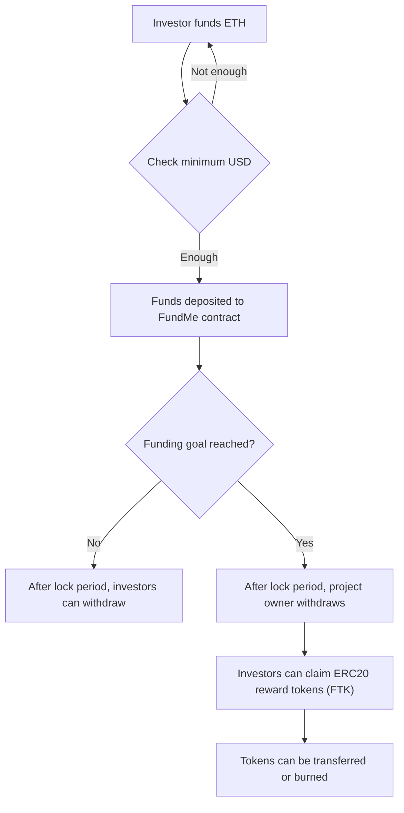
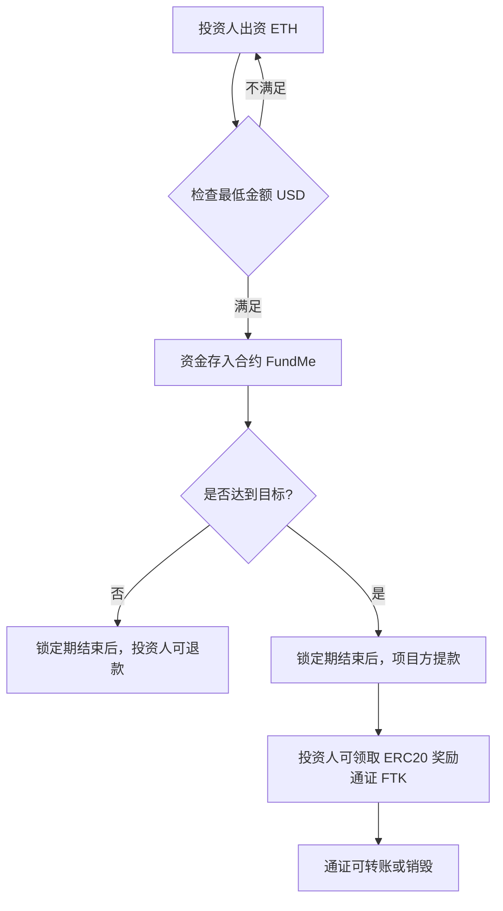

 **README.md （双语版）**，涵盖项目介绍 + 合约说明 + 部署步骤：

---

# Practical Blockchain Crowdfunding with Tokens and Oracles

# 基于区块链的实战众筹项目 —— 通证与预言机场景

🚀 A hands-on project demonstrating how to build a **crowdfunding dApp** on blockchain, combining:
🚀 本项目是一个区块链 **众筹去中心化应用（dApp）** 的实战案例，结合了以下功能：

* **FundMe**: Smart contract for crowdfunding with ETH → USD price feed via Chainlink Oracle.

* **FundMe**：众筹智能合约，集成 Chainlink 预言机，实时将 ETH 转换为 USD。

* **FundMeERC20**: Token contract to reward contributors with ERC20 tokens after successful funding.

* **FundMeERC20**：ERC20 通证合约，在众筹成功后，为投资人分发奖励代币。

---

## 🌍 Project Overview | 项目概览

This project illustrates **end-to-end crowdfunding lifecycle**:
本项目展示了一个 **端到端的众筹生命周期**：

1. Investors fund in ETH, with minimum contribution checked in **USD** using Chainlink Price Feed.
   投资人使用 ETH 出资，合约通过 Chainlink 预言机检查最低 USD 投资金额。

2. If the goal is reached after the lock period, the project owner withdraws funds.
   锁定期后，如果目标金额达到，项目方可提款。

3. If the goal is not reached, investors can withdraw their contributions.
   如果目标未达成，投资人可在锁定期后退款。

4. After successful funding, contributors can mint **reward tokens (FTK)**, transfer them, and later burn them upon redemption.
   众筹成功后，投资人可领取 **奖励代币 (FTK)**，可转账或在兑换权益后销毁。

---

## 🔄 Crowdfunding Lifecycle | 众筹生命周期
---





---

### 众筹生命周期 (中文)



---

📌 **说明 | Notes**

* **A → B**：投资人用 ETH 出资，Chainlink 预言机将 ETH 转换为 USD 检查最低门槛。
* **C → D**：资金进入合约后，判断是否达到目标金额。
* **E**：目标未达成 → 投资人退款。
* **F**：目标达成 → 项目方提款。
* **G → H**：众筹成功后，投资人可领取奖励代币 FTK，用于转账或兑换权益并销毁。

---
## 📂 Project Structure | 参考项目目录结构（部分需要自建）

```bash
blockchain-crowdfunding/
│
├── contracts/              # 智能合约目录
│   ├── FundMe.sol          # 众筹主合约（ETH → USD，集成 Chainlink 预言机）
│   ├── FundMeERC20.sol     # ERC20 奖励通证合约（FTK）
│   └── ...                 # 其他扩展合约
│
├── scripts/                # 部署与交互脚本
│   ├── deploy.js           # 部署合约脚本
│   └── interact.js         # 与已部署合约交互脚本
│
├── test/                   # 测试用例
│   ├── testFundMe.js       # 测试 FundMe 功能
│   ├── testFundMeERC20.js  # 测试 ERC20 奖励逻辑
│   └── ...
│
├── .env.example            # 环境变量示例文件（需复制为 .env 使用）
├── hardhat.config.js       # Hardhat 配置文件
├── package.json            # 项目依赖配置
└── README.md               # 项目说明文档（双语）
```

---

📌 **说明 | Notes**

* `contracts/` 放所有 Solidity 智能合约。
* `scripts/` 用于编写部署、升级、交互脚本。
* `test/` 存放 Hardhat 的自动化测试。
* `.env.example` 给用户一个参考，避免上传真实私钥。

---

## 📜 Contracts | 合约说明

* **FundMe.sol**

  * Handles crowdfunding contributions.
  * Integrates Chainlink ETH/USD Oracle.
  * Enforces lock duration and funding target.
  * Manages refunds and owner withdrawals.

  **FundMe.sol 功能**：

  * 处理众筹资金
  * 集成 ETH/USD 预言机价格
  * 执行锁定期和目标金额逻辑
  * 管理退款和所有者提款

* **FundMeERC20.sol**

  * ERC20 token contract (FTK).
  * Contributors can claim tokens proportional to their funding.
  * Supports transfer and burning of tokens.

  **FundMeERC20.sol 功能**：

  * ERC20 通证合约 (FTK)
  * 投资人可按出资比例领取通证
  * 支持通证转账与销毁

---

# 环境搭建与上链流程笔记项目的官方说明

---

# 📚 Practical Blockchain Crowdfunding with Tokens and Oracles

# 基于区块链的实战众筹 —— 通证与预言机场景

## 01. Environment Setup & Deployment | 环境搭建与部署


### 🔧 Development Environment | 开发环境

* **Git for Windows**

  * [Download Git](https://gitforwindows.org/)
* **Hardhat Introduction Tutorial | Hardhat 入门教程**

  * [Learnblockchain.cn Tutorial](https://learnblockchain.cn/article/1356)
* **NVM (Node Version Manager)**

  * Install guide: [CSDN 教程](https://blog.csdn.net/HuangsTing/article/details/113857145)
  * Windows Release: [nvm-windows](https://github.com/coreybutler/nvm-windows/releases)
  * Install Node 18+: [参考教程](https://blog.csdn.net/weixin_45345234/article/details/134118119)
* **Set npm → pnpm and mirror | 配置 npm 为 pnpm 并配置国内镜像**

  * [CSDN 参考](https://blog.csdn.net/yimeng_Sama/article/details/143824121)

---

### ⚙️ Hardhat Quick Start | Hardhat 快速开始

```bash
# 1. Create project | 创建项目
mkdir hardhat_demo && cd hardhat_demo

# 2. Init package manager | 初始化包管理工具
npm init -y

# 3. Install Hardhat (指定版本 2.22.2) | 安装 Hardhat
npm install --save-dev hardhat@2.22.2

# 4. Install toolbox (注意 ethers v6 API) | 安装工具包
npm install --save-dev @nomicfoundation/hardhat-toolbox

# 5. Start Hardhat | 启动 Hardhat
npx hardhat
```

⚠️ 注意：

* Hardhat 3.x 尚未适配 toolbox 6.x，请保持 Hardhat 2.x 版本。
* 新 API: `waitForDeployment()` + `.target` 替代旧 `.deployed()`。

---

### 📦 Smart Contract Libraries | 智能合约依赖库

```bash
# OpenZeppelin Contracts (推荐用 4.8.3 或 4.9.3)
npm install @openzeppelin/contracts@4.8.3

# Chainlink Oracles
npm install -D @chainlink/contracts
```

参考文档：

* [OpenZeppelin Contracts 官方文档](https://docs.openzeppelin.com/contracts/4.x)
* [中文版介绍](https://learnblockchain.cn/article/8348)

---

### 🔐 Environment Variables | 环境变量

新建 `.env` 文件，存放以下信息：

```ini
PRIVATE_KEY=0x你的测试钱包私钥
SEPOLIA_RPC_URL=https://sepolia.infura.io/v3/你的InfuraKey
ETHERSCAN_API_KEY=你的EtherscanKey
```

⚠️ 不要上传 `.env` 到 GitHub，必要时使用 `@chainlink/env-enc` 加密。

---

### 🚀 Deployment | 部署

```bash
# Compile contracts | 编译合约
npx hardhat compile

# Localhost deployment | 部署到本地网络
npx hardhat run scripts/deploy.js --network localhost

# Sepolia testnet deployment | 部署到测试网
npx hardhat run scripts/deploy.js --network sepolia
```

---

### 🧪 Testing | 测试

```bash
# Run tests | 运行测试
npx hardhat test --network localhost

# Run specific test file | 运行单一测试文件
npx hardhat run test/testFundMe.js --network localhost
```

---

